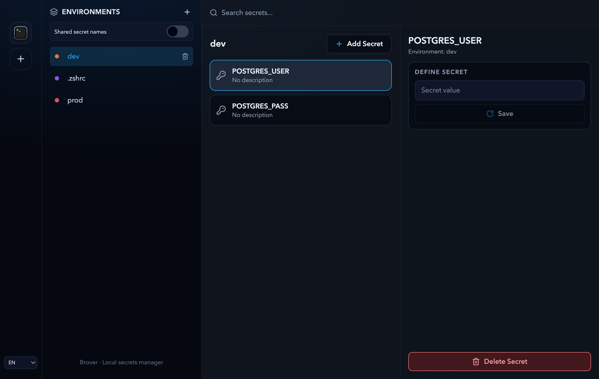

# brover

[](https://github.com/eber404/brover/actions/workflows/ci.yml)
[](https://github.com/eber404/brover/tree/badges)

Brover is macOS desktop app for managing local environment secrets across environments and launch terminals.

macOS-only for now.



## Features

- environments workflow for local setups;
- environment-scoped secret values stored in macOS Keychain;
- auth-gated reveal, copy, update, and delete actions;
- local JSON persistence for non-sensitive metadata only;
- onboarding from existing dotfiles or fresh start setup;
- ephemeral terminal launch with environment variables injected into selected terminal, without editing dotfiles during normal use.

## How It Works

- organize secrets by environment;
- keep secret values in Keychain and metadata in local app data;
- reuse one auth session for sensitive actions until in-memory TTL expires;
- optionally import selected plaintext values from existing dotfiles on first run;
- launch Warp, iTerm2, or Terminal with selected environment loaded for current session only.

## Requirements

- macOS;
- for secure secret storage and sensitive actions, Brover currently depends on macOS Keychain.

## Install

Install via Homebrew:

```sh
brew tap eber404/brover https://github.com/eber404/brover && brew install --cask brover
```

Current releases are unsigned and not notarized. For test installs, after dragging `Brover.app` into `/Applications`, run:

```sh
xattr -dr com.apple.quarantine "/Applications/Brover.app"
```

Why this is needed:

- macOS adds quarantine flag to apps downloaded from internet;
- because Brover is not signed and notarized yet, Gatekeeper may block app and show damaged-app warning;
- removing quarantine flag lets you open test build on machine where you trust source.

## Run in Dev

Install dependencies:

```sh
npm install
```

Start development app:

```sh
npm run dev
```

Useful checks:

```sh
npm run lint
npm run tsc
npm run test
npm run test:e2e
```

E2E uses isolated temp DB paths via `BROVER_DB_PATH` and cleans artifacts after each test.

## Maintenance rule

When architecture/scope changes, update both `AGENTS.md` and `README.md` in the same change set.
